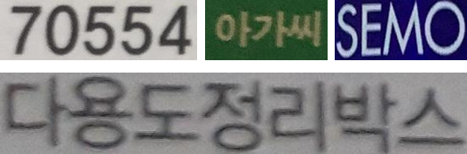
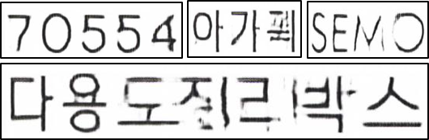
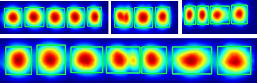
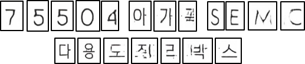
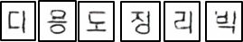
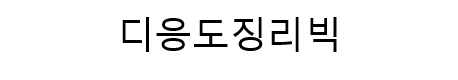

# MODEL SUMMARY
모델의 구조는 크게 6단계로 나뉩니다.

# STEP 0: Input Image

Predict 할 이미지를 모델에 입력합니다.

## STEP 1: Make Black and White Image

STEP 1 은 입력받은 이미지의 글자를 흑색으로, 배경을 백색으로 변환하는 과정입니다.  

## STEP 2: Make Fake image by GAN Model

 STEP 2 는 STEP 1에서 입력받은 이미지를 하나의 통일된 폰트의 이미지로 변환하는 과정입니다. 

모델은 Pix2Pix Image-to-Image Translation 모델의 Generator 를 이용하며, 기울어지거나 Blurring 된 이미지도 위와 같이 정렬 및 복원하여 출력합니다.

## STEP 3: Character-wise Text Detection - Bounding Box

STEP 3 는 STEP 2의 Word 단위로 출력된 이미지에 Charater 단위 Bounding Box 를 만드는 과정입니다.

Bounding Box 를 형성하는데 Naver Clova CRAFT 모델을 사용하며, 위와 같이 CRAFT 모델 결과로 나온 score map 을 이용하여 Bounding Box 를 만듭니다.

## STEP 4: Character-wise Text Detection - Cut Out Image

STEP4 는 Bounding Box 좌표값을 바탕으로 STEP 2의 이미지에서 이미지를 잘라내는 과정입니다.

## STEP 5: Character-wise Recognition

STEP 5 는 잘라낸 이미지를 글자로 변환하는 과정입니다.

다양한 폰트의 한글과 영어, 특수기호 이미지 데이터에 왜곡와 Blur 를 추가하여 학습한 모델을 사용하며, 각 Character 에 맞는 글자를 출력합니다.

## STEP 6: Make Result File

STEP 6 STEP 5 에서 Charater 단위로 출력한 글자를 조합하여 입력 이미지에 맞는 Word 를 출력하는 과정입니다.

# HOW TO PREDICT
제출된 submission 폴더로 들어간 뒤, images 폴더 내에 새 폴더를 생성합니다.
이때, 새 폴더의 이름을 "test"라 하겠습니다.

~~~
~submission/$ cd images
~submission/images/$ mkdir test
~~~
새로 생성된 test 폴더에 이미지들을 넣습니다.

이후, 아래 코드를 실행합니다.
~~~
~/submission/$ myOCR_6STEP.py --input_tag test --output_tag first
~~~

이후, 코드는 예측을 시작하며, 결과파일은 아래 경로에 저장됩니다.
~~~
~/submission/result/test_first/result.csv
~~~

# HOW TO TRAIN
본 대회 제출물에서 사용된 모델은 총 3개이며, 이 모델은 1개의 사전학습모델과 2개의 자체학습모델로 구성됩니다.

## PRE-TRAINED
이미지에서 단일 Character를 인식해내는 모델은 NAVER 팀의 CRAFT 사전학습모델을 사용하였습니다.
이 모델은 이미지를 입력받아, 단일 Character의 중심점 위치를 판단할 수 있는 score map을 반환합니다.
[REFERENCE-CRAFT](https://github.com/clovaai/CRAFT-pytorch)

## TRAIN
### GAN Image Generator
다양한 색상과 폰트, 크기를 가진 단어 이미지를 흑백 색상, 단일 폰트, 단일 크기를 가진 단어 이미지로 바꾸어주는 Image Generater Model 입니다. 
이 모델에서는 전처리된 이미지를 사용합니다. 전처리의 경우 아래와 같이 진행합니다.

~~~
# TO DO
~~~

아래 위치에 각각 원본데이터와 새로 제작하고자 하는 이미지를 저장합니다.
~~~
~/submission/GAN_train/images_preprocessed # 원본 이미지
~/submission/GAN_train/images_trans(default font) # 출력하고자 하는 이미지
~~~
각각 위치에는, 실재 학습에 사용된 30060장의 데이터가 들어가 있습니다.

~~~
~/submission/$ cd GAN_train
~/submission/GAN_train/Full_train.py
~~~
### Characterwise Image Recognizer
글자 인식 부분은 아래와 같이 학습 가능합니다.
~~~
~/submission/$ cd hangul-syllable-recognition
~/submission/hangul-syllable-recognition/$ python train.py
~~~
위 코드를 실행시키면 기존에 저정되어있는 학습용 이미지와 label로 학습을 시작하며, 일정 주기로 모델을 저장합니다.
~~~
~/submission/hangul-syllable-recognition/data/train_150000_F49/ # 학습용 이미지 저장소
~/submission/hangul-syllable-recognition/data/train_150000_F49.csv #학습용 이미지 정답 label
~/submission/hangul-syllable-recognition/saved_model/ #학습된 모델 저장 공간
~~~

학습용 이미지는 [TRGD](https://github.com/Belval/TextRecognitionDataGenerator)를 이용해 제작했으며, 상업적으로 이용 가능한 폰트 49종을 이용해 제작했습니다.
학습에 사용된 글자는 한글 KS X 1001 완성형 2350자와 영어 대소문자 52자, 특수기호 26자 (){}[]<>.\'?!:+-/*=~@#$%^& 숫자 10자를 포함해 총 2438자를 학습했습니다.

[REFERENCE-MODEL](https://github.com/junstar92/hangul-syllable-recognition)
[REFERENCE-TRDG](https://github.com/Belval/TextRecognitionDataGenerator)

# CONTRIBUTOR
고려대학교 김정기 (junggee97@naver.com)

한양대학교 정혜영 (miffy2315@naver.com)

포항공과대학교 한주완 (han0601@postech.ac.kr)